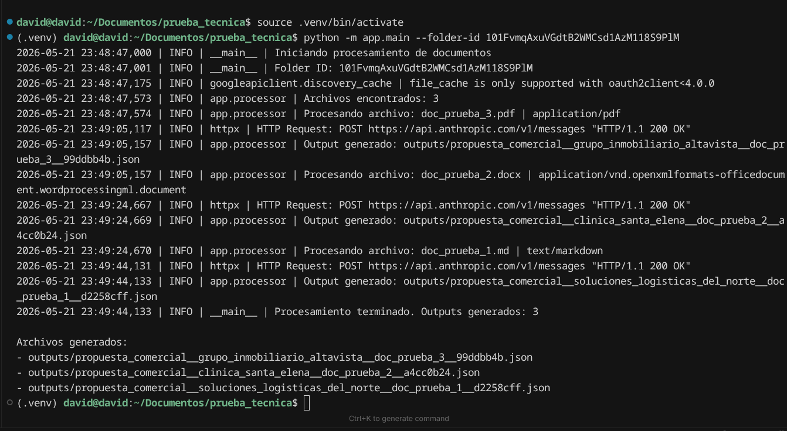
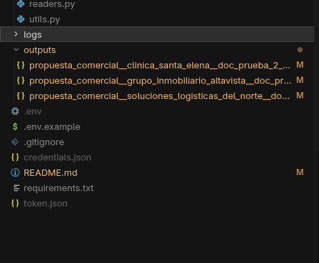

# Blackwell Doc AI

###  Aplicación CLI

Se decidió desarrollar el proyecto como una aplicación CLI en Python, ya que la prueba requiere procesar documentos desde Google Drive y generar archivos de salida. Este enfoque permite ejecutar el programa con mayor facilidad evitando ambiguedades en su ejecucion desde la terminal, priorizando un correcto funcionamiento del programa y una buena practica con la estructura del proyecto.

---


## Tabla de Contenidos
* [0.   Decisiones Técnicas](#0-Decisiones-Tecnicas)
* [1. Requisitos Previos](#1-requisitos-previos)
* [2. Clonación del Repositorio](#2-clonación-del-repositorio)
* [3. Estructura del Proyecto](#3-estructura-del-proyecto)
* [4. Configuracion de virtual enviroment](#4-configuracion-de-virtual-enviroment)
* [5. Instalacion de dependencias](#5-instalacion-de-dependencias)
* [6. Configuración de APIs y Variables de Entorno](#6-configuración-de-apis-y-variables-de-entorno)
  * [Crear el archivo .env](#crear-el-archivo-env)
  * [¿Cómo obtener el archivo credentials.json?](#cómo-obtener-el-archivo-credentialsjson)
* [7. Ejecución del Proyecto](#7-ejecución-del-proyecto)
  * [Obtener el ID de la carpeta de Google Drive](#obtener-el-id-de-la-carpeta-de-google-drive)
  * [Ejecutar procesamiento de archivos.](#ejecutar-procesamiento-de-archivos)

## Decisiones Técnicas. 
### ¿Por qué se uso Anthropic?
El proyecto requiere convertir documentos no estructurados en un archivo JSON, claude permite definir herramientas con esquemas JSON, lo que facilita generar respuestas estructuradas y validarlas con Pydantic antes de guardarlas. Es una buena opción para tareas de lectura, resumen y análisis de documentos largos. A su vez en un gran modelo que ayuda al momento de evitar alucinaciones tiene buena calidad de extracción de datos y facilidad de integración en Python.

### Uso controlado de Anthropic

Se utilizó Anthropic como proveedor de IA externo para generar el análisis estructurado de los documentos. Para esta prueba se trabajó con un presupuesto inicial de 5 USD, suficiente para validar el procesamiento de los documentos de ejemplo.

### Manejo de errores.
El sistema está diseñado para no detenerse si ocurre un error al procesar un documento.
Si un archivo no se puede leer o si el agente falla o si la respuesta no cumple con el formato esperado, el error se registra en logs y el sistema continúa con el siguiente documento.

Los logs se guardan en:

` logs/app.log`

### Normalización de nombres de archivo

Para generar archivos de salida seguros y compatibles entre sistemas operativos, se implementó una función `slugify()` en `app/utils.py`.

Esta función normaliza los textos antes de usarlos como parte del nombre del archivo. El proceso incluye:

- convertir el texto a minúsculas;
- eliminar acentos;
- reemplazar espacios por guiones bajos;
- eliminar signos y caracteres especiales;
- limitar la longitud máxima de cada sección del nombre.


## 1. Requisitos Previos

Antes de comenzar, asegúrate de tener instalado lo siguiente en tu sistema:
* **Python 3.10 o superior**
* **Git**
* Una cuenta de **Google Cloud** (con acceso a Google Drive API)
* Una API Key de **Anthropic Console**

## 2. Clonación del Repositorio

Abre tu terminal y clona este repositorio en tu computadora, luego navega dentro de la carpeta del proyecto:

```bash
# Clonar el repositorio
git clone https://github.com/GORDIAN12/blackwell-drive-doc-analyzer.git

# Entrar a la carpeta del proyecto
cd blackwell-doc-ai
```
## 3. Estructura del Proyecto

El código se dividió en módulos con responsabilidades claras:

```bash
blackwell-doc-ai/
│
├── app/
│   ├── main.py              # Punto de entrada de la CLI
│   ├── config.py            # Carga de variables de entorno (.env)
│   ├── models.py            # Esquemas Pydantic para estructurar el output
│   ├── drive_client.py      # Autenticación, listado y descarga de Drive
│   ├── readers.py           # Extracción de texto (txt, md, pdf, docx)
│   ├── ai_client.py         # Integración y llamadas a Anthropic
│   ├── processor.py         # Orquestador del flujo por documento
│   └── utils.py             # Helpers: formateo de nombres, logs y sanitización
│
├── outputs/                 # Carpeta local para resultados generados
├── credentials.json         # Credenciales OAuth de Google Cloud (Ignorado)
├── token.json               # Token de acceso de usuario (Ignorado)
├── .env.example             # Plantilla de variables de entorno
├── requirements.txt         # Dependencias del proyecto
└── README.md                # Documentación
```

Esta estructura facilita el mantenimiento, la lectura del código y futuras mejoras.

## 4. Configuracion de virtual enviroment
```
# Crear el entorno virtual en la raíz del proyecto
python3 -m venv .venv

# Activar el entorno virtual
source .venv/bin/activate
```

## 5. Instalacion de dependencias
```
pip install -r requirements.txt
```
## 6. Configuración de APIs y Variables de Entorno

Para que el proyecto funcione correctamente, es necesario configurar las llaves de acceso y las rutas del sistema en un archivo `.env`.

### Crear el archivo .env
Copia la plantilla de ejemplo `.env.example` para crear tu archivo de configuración local ejecutando en tu terminal:

```bash
cp .env.example .env
```
Modificamos  nuestras credenciales con los que se pide en nuestro archivo .env, agregando nuestra api de nuestro agente de anthropic y el modelo a usar del agente.

```
ANTHROPIC_API_KEY=tu_api_key_real      # Key privada de la consola de anthropic (https://console.anthropic.com/) 
CLAUDE_MODEL=claude-3-5-sonnet-latest  # Modelo de Claude a utilizar por el agente 

GOOGLE_CREDENTIALS_FILE=credentials.json   # Archivo JSON de credenciales descargado de Google Cloud
GOOGLE_TOKEN_FILE=token.json               # Archivo donde se guardará el token de sesión generado automáticamente

OUTPUT_DIR=outputs                      #Carpeta local donde se exportarán los resultados del procesamiento
LOG_FILE=logs/app.log                   #Ruta del archivo para el almacenamiento de logs y errores
```
### ¿Cómo obtener el archivo credentials.json?

Puedes generar y descargar este archivo desde la consola de Google Cloud. Si necesitas una guía visual paso a paso de cómo realizar la configuración, la pantalla de consentimiento OAuth y la descarga del cliente, revisa el material de apoyo que se encuentra en la siguiente carpeta de este repositorio:

 `app/google_cloud_configuration/STEPS_API.md`

Una vez descargado el archivo, muévelo a la raíz del proyecto y asegúrate de renombrarlo exactamente como `credentials.json`.


## 7. Ejecución del Proyecto

Para procesar los documentos de una carpeta de Google Drive, necesitas obtener su identificador único (**Folder ID**) y pasarlo como argumento al script.

### Obtener el ID de la carpeta de Google Drive
Abre la carpeta en tu navegador y copia únicamente la cadena de caracteres que aparece al final de la URL, después de `/folders/`:

```text
https://drive.google.com/drive/folders/101FvmqAxuxxxyyyyxxyyy
```

Eliminar los archivos existentes en la carpeta outputs para visualizar en tiempo real la creacion de los archivos antes de ejecutar el script.

```
rm outputs/*.json
```
### Ejecutar procesamiento de archivos.
 
```
python -m app.main --folder-id SUSTITUYE_AQUI_LA_DIRECCION_CARPETA
```

### Outputs 

Los archivos generados se pueden consultar en la carpeta `/outputs/` 



El nombre de cada archivo sigue la siguiente estructura:

```{clasificacion}__{cliente_o_proyecto}__{nombre_original}__{hash_corto}.json```

> [!NOTE]
> **Propósito de la estructura de nomenclatura:**
> 
> * **Organización eficiente:** Facilitas la navegación rápida al agrupar los archivos por tipo de documento, cliente asociado y nombre original.
> * **Prevención de colisiones:** El *hash* corto evita conflictos entre nombres idénticos sin exponer públicamente el ID completo de Google Drive.

### Presentacion de documentos

Salida de documentos en formato JSON, encontrandolos en la carpeta /outputs/



### Ejemplo de Output generado (JSON)

A continuación se muestra un ejemplo real del archivo JSON estructurado que genera el procesador tras analizar el docuemnto proporcionado:

<details>
<summary> <b><code> Haz clic aquí para desplegar el JSON de ejemplo </code></b></summary>

```json
{
{
  "documento": {
    "id": "1soULm14HrB_3zTnG4vnKF7IwhkdZXvAq",
    "nombre": "doc_prueba_1.md",
    "mime_type": "text/markdown"
  },
  "analisis": {
    "resumen_ejecutivo": [
      "Operativa MX Consultores presenta una propuesta de consultoría operativa a Soluciones Logísticas del Norte para optimizar su cadena de suministro y reducir tiempos de entrega.",
      "El cliente enfrenta un incremento del 34% en volumen de pedidos sin crecimiento operativo proporcional, generando retrasos, devoluciones y baja satisfacción del cliente.",
      "Se identificaron tres cuellos de botella críticos: tasa de error en picking del 8.2%, rutas de distribución desactualizadas y ausencia de trazabilidad de pedidos en tiempo real.",
      "El objetivo principal es reducir el tiempo de entrega promedio de 72 a 48 horas en cinco meses, bajar la tasa de error en picking al 2.5% y habilitar trazabilidad para 40 clientes corporativos.",
      "El proyecto se estructura en tres fases: diagnóstico detallado (semanas 1–3), diseño de soluciones (semanas 4–6) e implementación y acompañamiento (semanas 7–20).",
      "Los responsables clave son el Ing. Roberto Cisneros y la Lic. Mariana Fuentes por parte del cliente, y el Arq. Tomás Villanueva como líder de consultoría.",
      "Los principales riesgos incluyen resistencia al cambio, dependencia de un proveedor externo para el sistema de escaneo y la coincidencia de la fase de implementación con la temporada alta de ventas.",
      "El esquema de pago es escalonado: 40% al inicio, 30% al arranque de la Fase 3 y 30% al cierre del proyecto."
    ],
    "extraccion_estructurada": {
      "cliente_o_proyecto": "Soluciones Logísticas del Norte",
      "objetivo_principal": "Reducir los tiempos de entrega promedio de 72 a 48 horas en cinco meses, disminuir la tasa de error en picking al 2.5% y habilitar un sistema básico de trazabilidad de pedidos para los 40 clientes corporativos activos.",
      "entregables": [
        "Mapeo completo del proceso de almacén y distribución",
        "Entrevistas con operadores, supervisores y clientes clave",
        "Reporte de hallazgos con métricas de línea base",
        "Rediseño de rutas de distribución con herramienta de optimización",
        "Propuesta de implementación de sistema de escaneo en picking",
        "Diseño de tablero de seguimiento de pedidos (versión básica)",
        "Capacitación de operadores en nuevos procesos",
        "Puesta en marcha del sistema de escaneo",
        "Seguimiento mensual de indicadores con reporte ejecutivo",
        "Documentación y materiales generados al cierre del proyecto"
      ],
      "fechas_y_plazos": [
        "Fase 1 — Diagnóstico detallado: semanas 1 a 3",
        "Fase 2 — Diseño de soluciones: semanas 4 a 6",
        "Fase 3 — Implementación y acompañamiento: semanas 7 a 20",
        "Duración total del proyecto: 5 meses a partir de la firma",
        "Confirmación de tiempos del proveedor de escaneo requerida antes de la semana 7",
        "Riesgo de temporada alta en octubre-noviembre durante la fase de implementación",
        "Documento preparado en marzo 2026"
      ],
      "responsables": [
        "Ing. Roberto Cisneros — Gerente de Operaciones (Director de proyecto, cliente)",
        "Lic. Mariana Fuentes — Coordinadora de Almacén (Responsable de implementación, cliente)",
        "Arq. Tomás Villanueva — Socio Director, Operativa MX (Líder de consultoría)"
      ],
      "riesgos": [
        "Resistencia del equipo operativo al cambio de procesos — mitigado con programa de capacitación y comunicación interna.",
        "Dependencia de proveedor externo para el sistema de escaneo — requiere confirmar tiempos de entrega e instalación antes de la semana 7.",
        "Temporada alta de ventas en octubre-noviembre coincide con la fase de implementación — se recomienda adelantar arranque o acordar pausas planificadas."
      ]
    },
    "clasificacion": "propuesta_comercial",
    "proximos_pasos": [
      "Obtener la firma del contrato por ambas partes para formalizar el inicio del proyecto y activar el primer pago del 40%.",
      "Confirmar con el proveedor externo los tiempos de entrega e instalación del sistema de escaneo antes de que inicie la semana 7.",
      "Agendar las entrevistas con operadores, supervisores y clientes clave para la Fase 1 de diagnóstico (semanas 1–3).",
      "Evaluar con el cliente la posibilidad de adelantar el arranque del proyecto para evitar que la Fase 3 coincida con la temporada alta de octubre-noviembre.",
      "Definir y comunicar internamente el plan de gestión del cambio para reducir la resistencia del equipo operativo antes del inicio de la implementación."
    ]
  }
}
}
```

</details>


## Qué faltó o qué mejoraría con más tiempo

El programa cumple con el proposito de la prueba que son leer documentos desde Google Drive, extraer texto, analizarlos con un agente inteligente y generar un archivo JSON por documento, se pueden seguir mejorando el sistema para futuras mejoras.

### 1. Soporte para más tipos de documentos.
El sistema ya soporta `.txt`, `.md`, `.pdf`, `.docx`. Como mejora del sistema se puede expandir agregando soporte para:

- Google Slides;
- Google Sheets;
- imágenes con texto.

### 2. Interfaz web

Para una version mas practica e intuitiva, podría agregarse una interfaz web simple, donde el usuario pueda ingresar el ID de la carpeta de Drive, ejecutar el procesamiento y visualizar los resultados sin el uso de la terminal.

### 3. Procesamiento de documentos largos

Actualmente el sistema limita la cantidad de texto enviada a la IA para evitar exceder límites de tokens. Con más tiempo, implementaría un sistema de `chunking`, dividiendo documentos largos por secciones y combinando los resultados parciales en un análisis final.

Esto permitiría procesar documentos extensos sin perder información importante.

### 4. Solucion a la Problematica enconrada en las pruebas 

En la prueba se observó un error `529 Overloaded` de Anthropic, lo cual indica saturación temporal del servicio externo. El programa no se detuvo y continuó con los demás archivos, cumpliendo el requisito de tolerancia a fallos.

Como mejora futura, agregaría una estrategia de reintentos con espera para errores temporales de la API, como `529 Overloaded`, y un modo incremental para no volver a procesar documentos que ya tienen output generado.

