### Obtención de Credenciales en Google Cloud

Para conectar la aplicación con Google Drive, necesitas generar un archivo `credentials.json`. Sigue estos pasos:

1. Ve a la [Google Cloud Console](https://console.cloud.google.com/) y crea un nuevo proyecto.
2. Habilita la **Google Drive API** desde el apartado de "API y servicios".
3. Configura la *Pantalla de consentimiento de OAuth* en modo **Externo** y añade tu correo en *Test Users*.
4. Ve a **Credenciales > Crear credenciales > ID de cliente de OAuth**.
5. Selecciona **Tipo de aplicación: Aplicación de escritorio**, asígnale un nombre y haz clic en **Crear**.

  
📸 Haz clic aquí para ver la guía visual paso a paso

  #### Paso 1: Crear un proyecto
  En google cloud da click en el boton "selecciona un proyecto".
  
  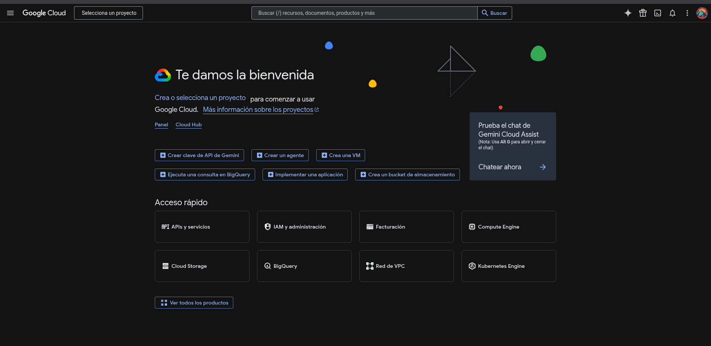

  #### Paso 2: Crear un proyecto nuevo 
  Si no se tiene un proyecto crear uno nuevo "Proyecto nuevo".
  
  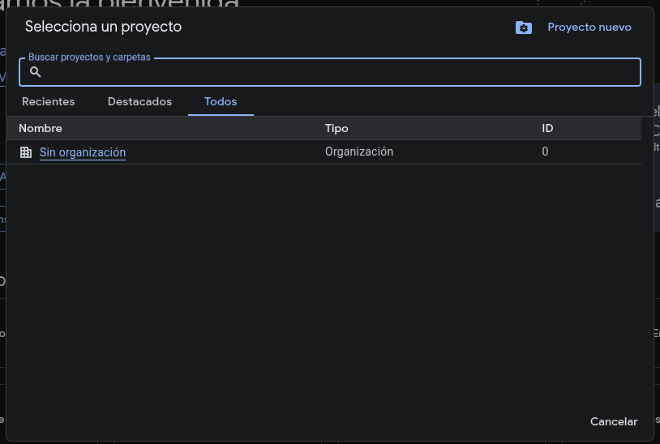
  
  #### Paso 3: Asignar nombre
  Asginale un nombre al proyecto y da click en "crear".
  
  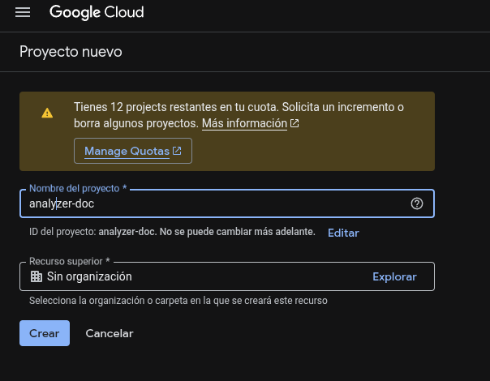

  #### Paso 4: Ir a la Biblioteca de APIs 
  Seleccionamos la barra de despliegue de la izquierda slecionando en "APIS y servicios" el apartado de "biblioteca".
  
  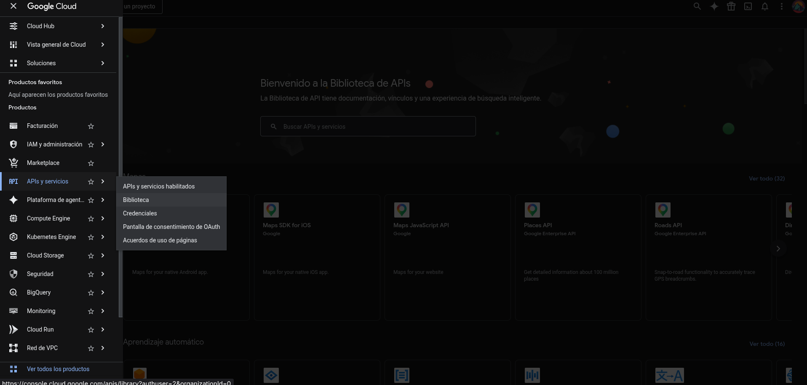

  #### Paso 5. Buscar la API de Google Drive
  En la barra de busqueda buscamos "google drive api" y seleccionamos la opcion que nos muestra primero.
  
  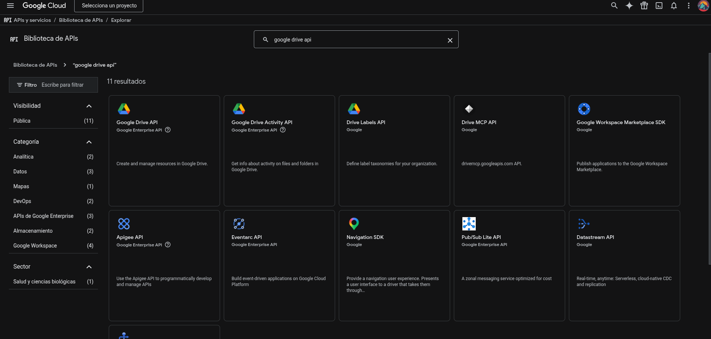

  #### Paso 6. Habilitar la API 
  Habilitamos la opcion de google drive api.

  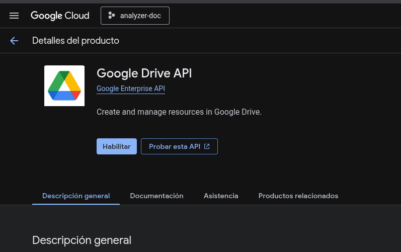

  #### Paso 7. Creacion de ID OAuth
  En la barra lateral izquierda seleccionamos "credenciales", damos click en el apartado de "ID de cliente OAauth"
  
  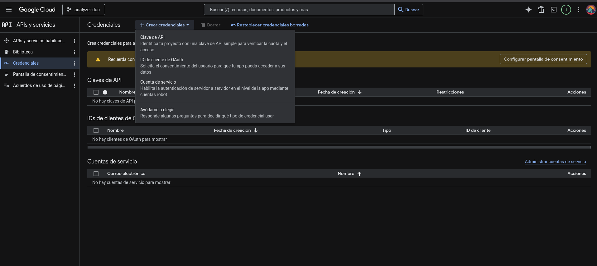

  #### Paso 8. COnfiguracion de pantalla de consentimiento
  Damos click en la parte de clientes para configurar la pantalla de consentimiento si aun no la tenemos configurada, si ya esta configurada no es necesario este paso.
  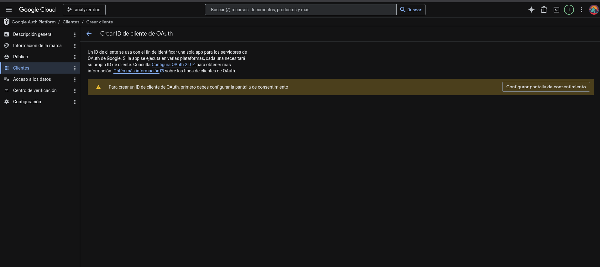

  #### Paso 9. Formulario de datos de Consentimiento
  LLenamos los datos necesarios. Seleccionamos en Publico la opcion que sea mas conveniente para su uso ya sea privado o publico, una vez teminando de llenar los datos necesarios, seleccionamos el boton de finalizar.
  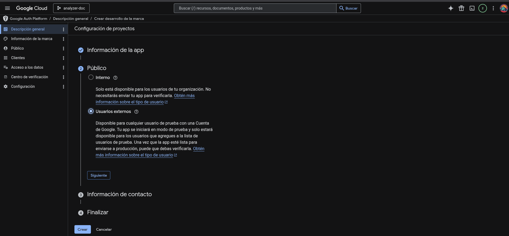

  #### Paso 10. Crear cliente OAuth
  En la opcion de las metricas creamos el cliente OAuth, si aun no esta configurado para este proyecto.
  
  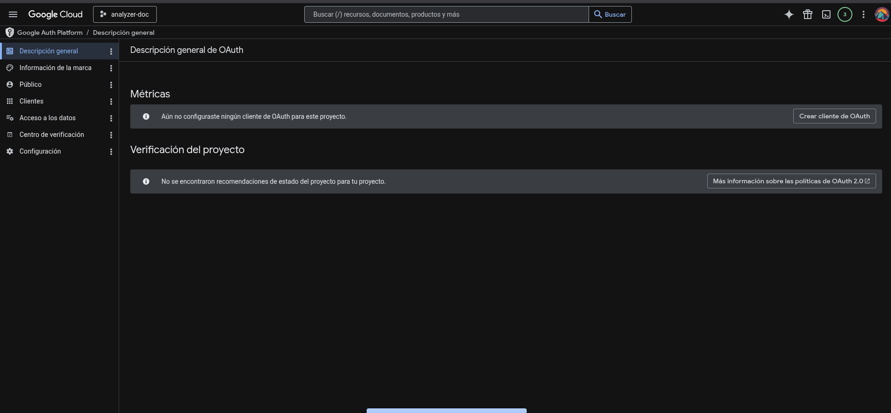

  #### Paso 11. Llenado de datos 
  Llenamos los datos necesariso para crear el ID del cliente OAuth.
  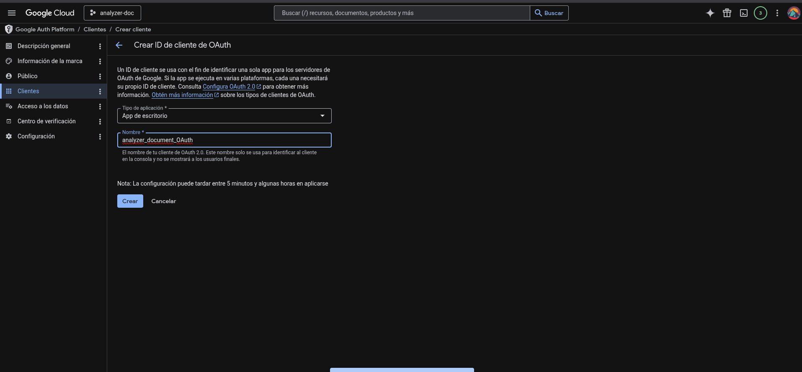

  #### Paso 12. Credenciales de proyecto de drive
  Una vez llenado los datos del ID cliente OAuth, nos mostrara las credenciales de nuestre cliente, aqui obtenemos el archvio credentials.json lo descargamos y lo movemos a la ubicacion de nuestro proyecto
  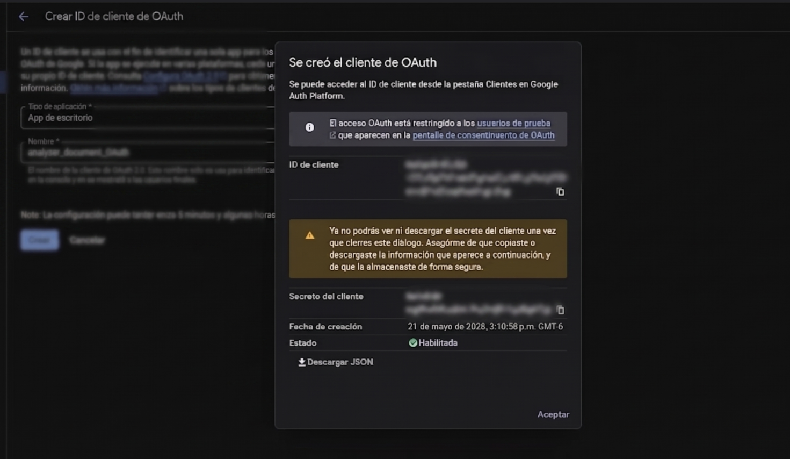

   >  **Nota final:** Recuerda renombrar el archivo descargado exactamente como `credentials.json` y moverlo a la carpeta raíz de este proyecto.
  
  #### Paso 13. Habilitar permisos de acceso
  Habilitamos la opcion de usuarios de Prueba, agregando el correo electronico para los permisos de acceso. 
  
  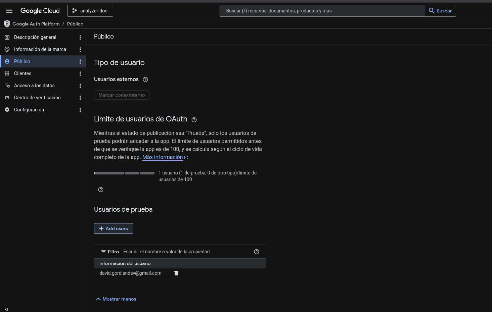

