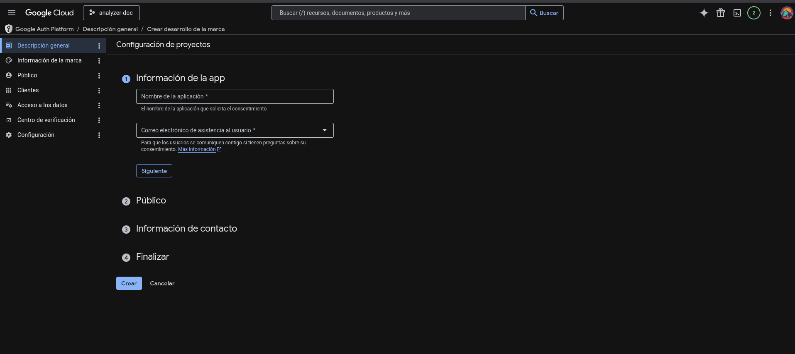
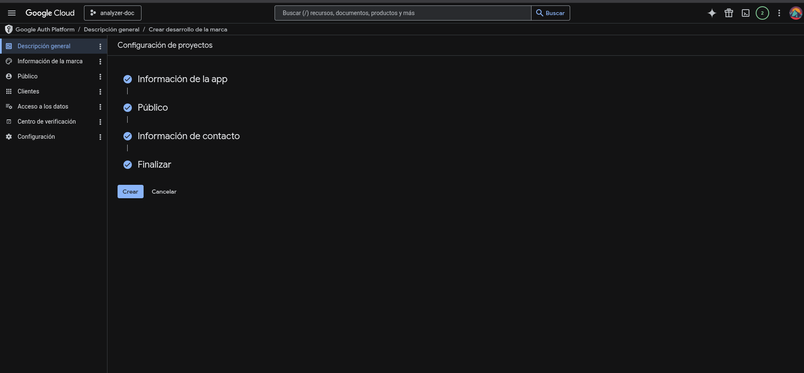

# configuración de Google Drive API (OAuth)

| Campo | Detalle |
|-------|---------|
| **Objetivo** | Obtener `credentials.json` para que la aplicación acceda a Google Drive en modo lectura |
| **Audiencia** | Desarrolladores que despliegan o ejecutan el proyecto por primera vez |
| **Resultado esperado** | Archivo `credentials.json` en la raíz del repositorio y primer inicio de sesión OAuth completado |

---

## 1. Resumen

La aplicación se conecta a **Google Drive** mediante OAuth 2.0. El flujo requiere:

1. Un **proyecto** en Google Cloud Console.
2. La **Google Drive API** habilitada.
3. Una **pantalla de consentimiento OAuth** configurada (modo externo + usuarios de prueba).
4. Un **ID de cliente OAuth** de tipo *Aplicación de escritorio*.
5. El archivo **`credentials.json`** descargado y colocado en la raíz del proyecto.

En el primer arranque, el cliente abre el navegador, el usuario autoriza el acceso y se genera automáticamente `token.json` (no debe subirse a Git).

---

## 2. Requisitos previos

- Cuenta de Google con acceso a [Google Cloud Console](https://console.cloud.google.com/).
- Permisos para crear proyectos y credenciales OAuth en la organización (si aplica políticas corporativas).
- Carpeta de Drive compartida o accesible con los documentos a procesar (el `folder_id` se configura aparte en `.env`).

---

## 3. Entregables y ubicación en el proyecto

| Archivo | Origen | Ubicación | En Git |
|---------|--------|-----------|--------|
| `credentials.json` | Descarga desde Consola → Credenciales OAuth | Raíz del repositorio (`/blackwell-drive-doc-analyzer/credentials.json`) | No (`.gitignore`) |
| `token.json` | Generado al autorizar la app la primera vez | Raíz del repositorio | No (`.gitignore`) |

Variable de entorno (por defecto en `.env`):

```env
GOOGLE_CREDENTIALS_FILE=credentials.json
GOOGLE_TOKEN_FILE=token.json
```

**Alcance solicitado por la aplicación:** lectura de Drive (`drive.readonly`), definido en `app/drive_client.py`.

---

## 4. Checklist rápido

Marca cada ítem al completarlo:

- [ ] Proyecto creado en Google Cloud
- [ ] Google Drive API habilitada
- [ ] Pantalla de consentimiento OAuth configurada (Externo)
- [ ] Usuario de prueba añadido (tu correo)
- [ ] ID de cliente OAuth → **Aplicación de escritorio**
- [ ] `credentials.json` descargado, renombrado y copiado a la raíz del proyecto
- [ ] Primera ejecución de la app: autorización en navegador y `token.json` generado

---

## 5. Procedimiento detallado

### Fase A — Proyecto en Google Cloud

| Paso | Acción |
|------|--------|
| A.1 | Abrir [Google Cloud Console](https://console.cloud.google.com/). |
| A.2 | En el selector superior, pulsar **Seleccionar un proyecto** → **Proyecto nuevo**. |
| A.3 | Asignar nombre al proyecto y pulsar **Crear**. Esperar a que el proyecto quede activo. |

### Fase B — Habilitar Google Drive API

| Paso | Acción |
|------|--------|
| B.1 | Menú lateral: **APIs y servicios** → **Biblioteca**. |
| B.2 | Buscar `Google Drive API` y abrir el resultado oficial. |
| B.3 | Pulsar **Habilitar** y confirmar que el estado quede como habilitada. |

### Fase C — Pantalla de consentimiento OAuth

| Paso | Acción |
|------|--------|
| C.1 | **APIs y servicios** → **Pantalla de consentimiento de OAuth**. |
| C.2 | Tipo de usuario: **Externo** (adecuado para desarrollo y pruebas con usuarios de prueba). |
| C.3 | Completar datos obligatorios de la app (nombre, correo de soporte, etc.) y **Guardar y continuar** hasta finalizar el asistente. |
| C.4 | En **Usuarios de prueba**, añadir el correo Google con el que iniciarás sesión al autorizar la app. Sin esto, el acceso fallará en modo de prueba. |

> **Nota:** Si la pantalla de consentimiento ya estaba configurada en el proyecto, puedes omitir los campos que no cambien y pasar directamente a la Fase D.

### Fase D — Credenciales OAuth (cliente de escritorio)

| Paso | Acción |
|------|--------|
| D.1 | **APIs y servicios** → **Credenciales** → **Crear credenciales** → **ID de cliente de OAuth**. |
| D.2 | Si la consola lo solicita, completar o vincular la pantalla de consentimiento (Fase C). |
| D.3 | Tipo de aplicación: **Aplicación de escritorio**. Asignar un nombre descriptivo (p. ej. `drive-readonly-desktop`). |
| D.4 | **Crear** y, en el diálogo resultante, **Descargar JSON**. |
| D.5 | Renombrar el archivo descargado exactamente a `credentials.json` y moverlo a la **raíz del proyecto** (mismo nivel que `README.md` y `.env`). |

### Fase E — Integración con esta aplicación

| Paso | Acción |
|------|--------|
| E.1 | Verificar que `GOOGLE_CREDENTIALS_FILE=credentials.json` en `.env`. |
| E.2 | Ejecutar la aplicación (`python -m app.main` o el comando documentado en `README.md`). |
| E.3 | Se abrirá el navegador para iniciar sesión y conceder permisos de lectura en Drive. |
| E.4 | Tras autorizar, se creará `token.json` en la raíz; las siguientes ejecuciones reutilizarán ese token (y lo refrescarán si expira). |

Si aparece `FileNotFoundError` indicando que no existe `credentials.json`, revisa la ruta y el nombre del archivo (sensible a mayúsculas/minúsculas en Linux).

---

## 6. Guía visual paso a paso

Las capturas siguientes corresponden a la consola de Google Cloud en español. Úsalas junto con las fases anteriores si necesitas referencia gráfica.

<details>
<summary><strong>Ver capturas de pantalla (13 pasos)</strong></summary>

### Paso 1 — Abrir selector de proyecto

En la barra superior, pulsar **Seleccionar un proyecto**.


### Paso 2 — Crear proyecto nuevo

Elegir **Proyecto nuevo** si aún no existe uno para esta aplicación.


### Paso 3 — Nombre del proyecto

Introducir el nombre y pulsar **Crear**.


### Paso 4 — Biblioteca de APIs

Menú lateral: **APIs y servicios** → **Biblioteca**.


### Paso 5 — Buscar Google Drive API

En el buscador, escribir `Google Drive API` y abrir el resultado.


### Paso 6 — Habilitar la API

Pulsar **Habilitar**.


### Paso 7 — Ir a credenciales OAuth

**APIs y servicios** → **Credenciales** → flujo para crear **ID de cliente de OAuth**.


### Paso 8 — Pantalla de consentimiento

Si aún no está configurada, la consola guiará a **Configurar pantalla de consentimiento** antes de crear el cliente.


### Paso 9 — Datos del formulario de consentimiento

Completar los campos obligatorios del asistente.



### Paso 10 — Tipo de usuario (Externo)

Seleccionar **Externo** cuando corresponda al entorno de pruebas.


### Paso 11 — Resumen de configuración

Revisar y finalizar la configuración de la pantalla de consentimiento.



### Paso 12 — Crear cliente OAuth

Desde **Credenciales**, crear el **ID de cliente de OAuth** (tipo escritorio).


### Paso 13 — Formulario del cliente

Tipo: **Aplicación de escritorio**. Guardar y continuar.


### Paso 14 — Descargar `credentials.json`

En el detalle del cliente, usar **Descargar JSON** y colocar el archivo en la raíz del proyecto con el nombre `credentials.json`.


### Paso 15 — Usuarios de prueba

En la pantalla de consentimiento, sección **Usuarios de prueba**: añadir el correo que usarás para autorizar la app.


</details>

---

## 8. Seguridad y buenas prácticas

- **No** subir `credentials.json` ni `token.json` al repositorio (ya están en `.gitignore`)
- El alcance actual es solo lectura; no conceder permisos de escritura salvo que el código lo requiera en el futuro.

---

